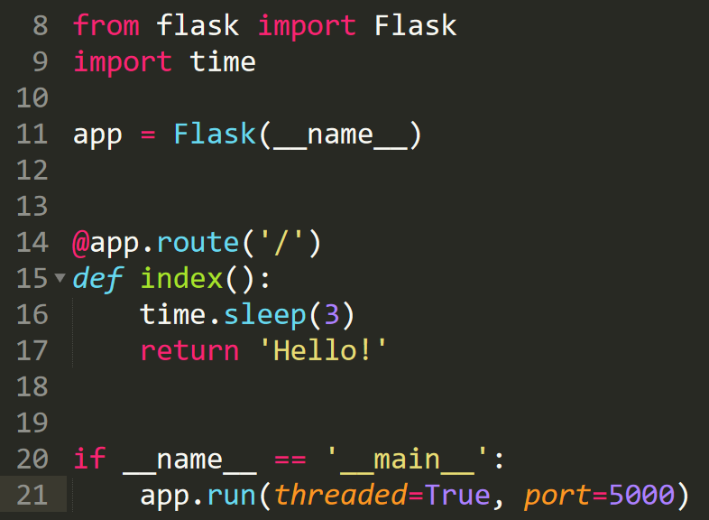
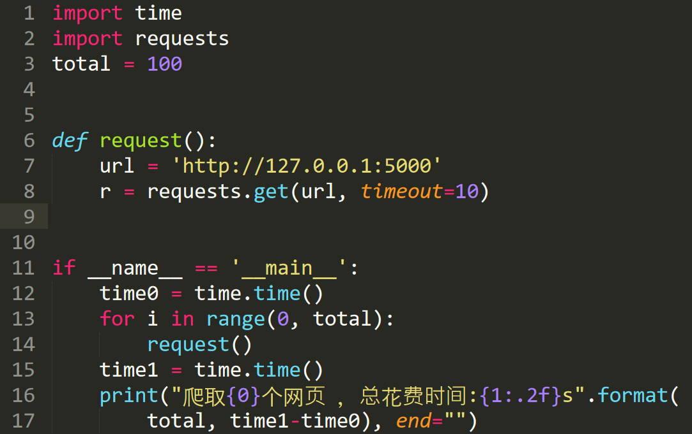
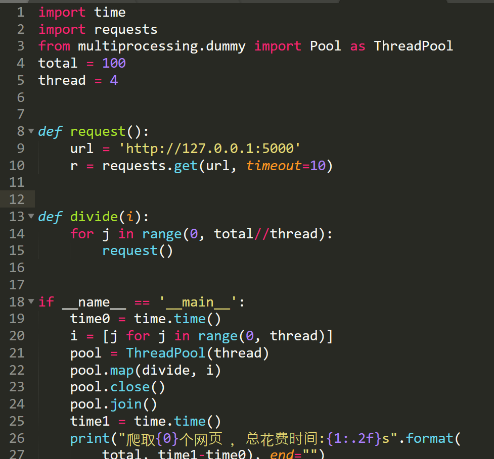
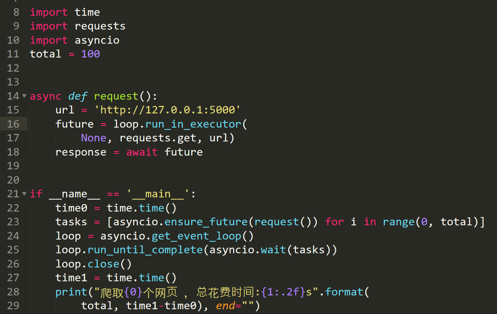

# 线程，协程对比和Python爬虫实战说明
## 本文最后更新于2018-7-30，可能会因为没有更新而失效。如已失效或需要修正，请联系我！  
## 这篇文章写的是我对线程和协程的理解，有错误之处欢迎指出。  
举一个餐馆的例子。我们把一个餐厅当做一个进程，如果这个餐厅只有1个服务员，那么这个餐厅是
单线程的；如果这个餐厅有2个服务员，那么这个餐厅是双线程的。
如果这个餐厅的服务员像海底捞的服务员一样，一次只服务一桌的客人，在这桌的客人离开前不会服务
下一桌的客人，那么我们称这个线程是阻塞的。如果一个服务员同时服务多桌客人，那么我们称这个线程
是非阻塞的。  
**实现了非阻塞的线程我们称之为协程，也就是说协程是依赖线程的存在**      
下面就是Python的爬虫实战对比说明   
我先写了一个本地的flask应用，在返回网页前等待3秒模拟真实网络爬虫  
    
单线程爬虫：  
   
共花费301秒   

多线程爬虫：   
      
共花费75秒   
 
单线程协程爬虫：  
    
共花费9秒    
可以看出单线程的协程爬虫速度已经非常快了  

多线程协程爬虫：    
      
共花费3秒     
多线程和协程结合，能够使得爬虫的速度达到极致  
参考资料：  
*   [一个故事讲完进程、线程和协程](https://mp.weixin.qq.com/s?__biz=MzAxOTc0NzExNg==&mid=2665514652&idx=1&sn=e10a979f89d594f2f51255b5834b80f7&chksm=80d67edfb7a1f7c987c7f2da9d1de24be5047ba2c8f20dd1735b0208d9b31a210c6f65ea545d&mpshare=1&scene=23&srcid=0730bT4VM0zk69zY8PL6oF6h#rd)
*   [asyncio：高性能异步模块使用介绍](https://mp.weixin.qq.com/s?__biz=MjM5MzgyODQxMQ==&mid=2650368555&idx=1&sn=a449f107c9c16466c51ce8a6939fcb1b&chksm=be9cd17f89eb5869c00e964e42e79400d4c9b993c4c5764ddbf9ef0e4b85741fc4ab05c77dbc&mpshare=1&scene=23&srcid=07163jZEvRwfwwii9F8dKopl#rd)
*   [Python中异步协程的使用方法介绍](https://cuiqingcai.com/6160.html)
*   [在 Python 中按需处理数据，第 3 部分 协程和 asyncio](https://www.ibm.com/developerworks/cn/analytics/library/ba-on-demand-data-python-3/index.html)
*   [How could I use requests in asyncio?](https://stackoverflow.com/questions/22190403/how-could-i-use-requests-in-asyncio)
*   
*   

